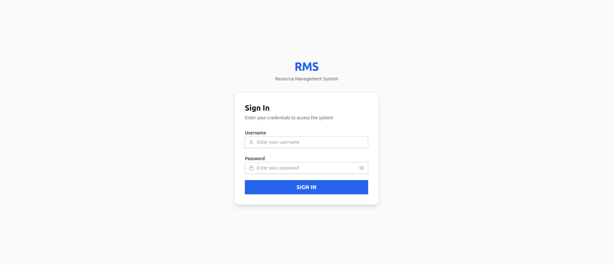

# Feature: design-system-tokens

## Overview
Centralize design tokens (colors, spacing, typography) via Tailwind v4 theme and a common CSS file; update all existing components to use the tokens.

## Branch
feature/KAN-4-design-system-improvement

## Tasks
| # | Type | Name | Status |
|---|------|------|--------|
| 1 | Logic/Backend | Generate design tokens using color-token-generator skill | done |
| 2 | Logic/Backend | Configure Tailwind CSS v4 theme and create common CSS file | done |
| 3 | UI/Design | Update existing atom components to use design tokens | done |
| 4 | UI/Design | Update LoginForm molecule and login page with new styles and full responsiveness | done |

## Progress Log
- [2026-04-14] Feature scaffolded. Branch created: feature/KAN-4-design-system-improvement
- [2026-04-14] Logic implemented: src/styles/tokens.css (CSS custom properties, :root block), src/styles/tokens.ts (TS token export named `tokens`)
- [2026-04-14] Logic implemented: src/index.css (added imports for tokens.css + common.css, updated @theme with --color-primary: var(--color-primary-600), added @theme inline block mapping all 8 color scales), src/styles/common.css (base resets, typography, focus ring, link/button/input defaults, dark mode overrides block)
- [2026-04-14] Design implemented: Button, Input, Label atoms refactored to use token-based Tailwind classes; LoginForm and login page updated with responsive centered layout and primary blue theme.
- [2026-04-14] Feature complete. QA passed (design-qa: yes, dev-qa: yes). Verification passed (tsc: ✅, build: ✅, console: ✅). Branch: feature/KAN-4-design-system-improvement

## Verification
| Check | Result |
|-------|--------|
| TypeScript (`pnpm tsc --noEmit`) | ✅ Pass |
| Production build (`pnpm build`)  | ✅ Pass |
| Console errors (all pages)       | ✅ None |

## Screenshots

## Outcome
Implemented a centralized design token system (CSS custom properties + TypeScript exports) with a blue primary theme. Wired all tokens into Tailwind CSS v4 via `@theme inline` and a `common.css` base layer. Refactored `Button`, `Input`, and `Label` atoms to consume token-based classes exclusively. Updated `LoginForm` molecule and `login.tsx` page with a clean, fully responsive centered layout using the new primary blue design language. All acceptance criteria met.
